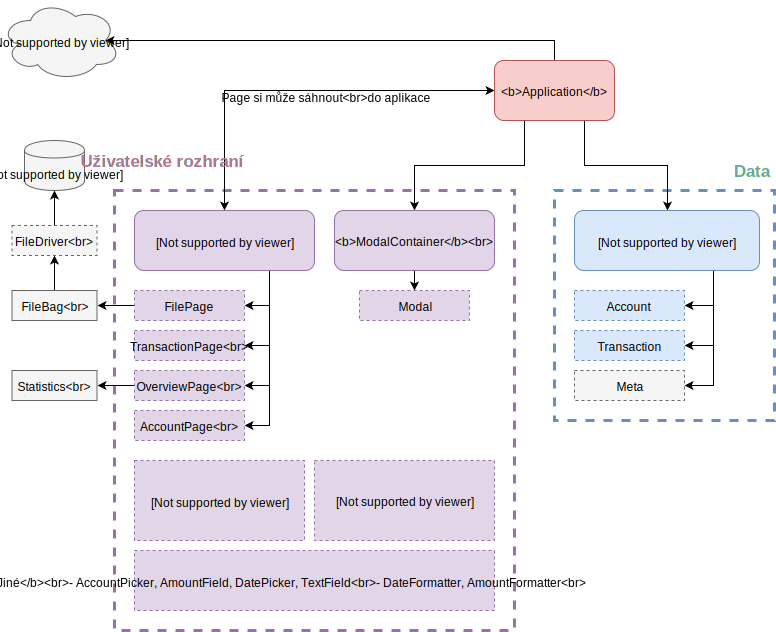

# Aplikace



Tedy celá aplikace žije uvnitř třídy `Application`, která dostane kořenový html element, ve kterém si může hospodařit.

```js
const Application = require("../code/Application.js")
window.app = new Application(window, document, "#app")
```

## Vlastnosti


### `file`

Právě otevřený soubor. Instance typu `File` nebo `null`.

Soubor se "otevře" pouhým dosazením do `file` a `fileDescriptor`. Poté je možné přejít na stránku, která vyžaduje, aby `file` nebyl `null`.

> Konkrétně otevírání probíhá v `FilePage.openFile(descriptor)`.


### `fileDescriptor`

Popisuje, kde je momentální soubor uložený a jaký má název. Viz `FileBag`.


### `page`

Momentálně otevřená stránka uživatelského rozhraní. Instance `pages/Page`.


### `modals`

Jediná instance třídy `ModalContainer` uvnitř aplikace. Spravuje otevírání a zobrazování dialogových oken.


## Metody


### `gotoPage(PageConstructor)`

Provede otevření jiné stránky uživatelského rozhraní.

Příklad:

```js
const TransactionPage = require(".../pages/TransactionPage.js")
app.gotoPage(TransactionPage)
```

> Stará se o zavření současné stránky. Volá její metodu `close()` a poté ji zapomene a garbage-collector ji uvolní.


### `saveAndCloseFile()`

Zavře současný soubor, uloží ho podle deskriptoru a přejde na `FilePage`.
